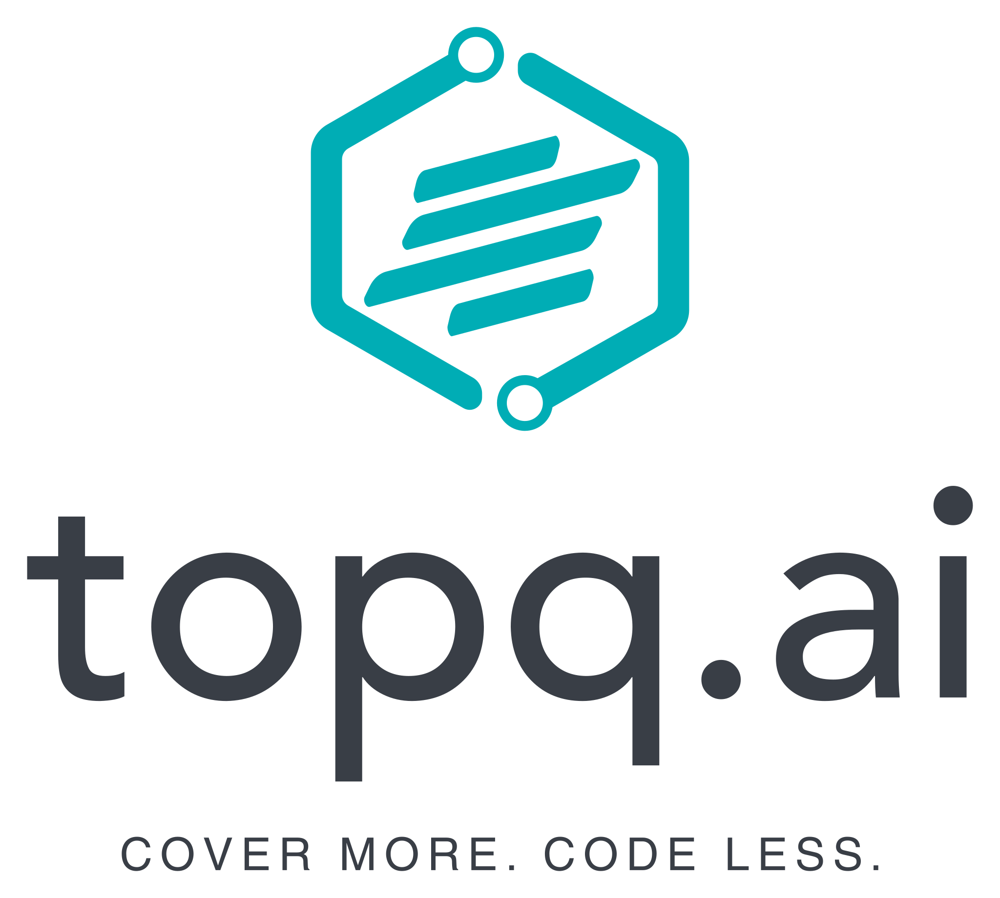

  

---

## 🚀 About Us

Welcome to **topq.ai**! We are committed to making your life easier by automating your testing process with **Combinatorial Testing (CT)** and **Artificial Intelligence (AI)**. Our mission is to build the next generation of intelligent testing agents that can automatically design, execute, and learn from sophisticated test scenarios.

### What is Combinatorial Testing?

Combinatorial Testing is a powerful testing methodology that systematically tests combinations of parameter values to efficiently find interaction-based faults. Instead of exhaustive testing, which is often impossible, CT provides a more practical and scientific approach to achieve higher test coverage with fewer test cases.

### How AI Changes the Game

By integrating AI, we can elevate CT to new heights. Our vision is to bring AI agents to you, that

- **Learn** from application behavior to intelligently select test parameters.
- **Automate** the generation of complex, multi-variable test cases.
- **Optimize** test suites in real-time based on feedback.
- **Predict** and prioritize critical areas of an application for testing.

This is the future of testing.

## 🎯 Our Focus

- **Open Source Tools**: Developing and maintaining a suite of open-source tools for AI-driven combinatorial testing.
- **Research**: Pushing the boundaries of what's possible in automated software testing.
- **Community**: Building a vibrant community to share knowledge, collaborate on projects, and promote best practices.

## 🛠️ Get Involved

We are always looking for passionate individuals to contribute! Whether you're an expert in testing, a machine learning guru, or just curious about our work, there are many ways to get involved:

- ⭐ **Star our repositories** to show your support.
- 🍴 **Fork a project** and submit a pull request.
- 🐛 **Report issues** or suggest new features.

## Featured Repositories

- **[pict-mcp](https://github.com/topq-ai/pict-mcp)**: An MCP server for integrating the PICT tool with your AI agents.
